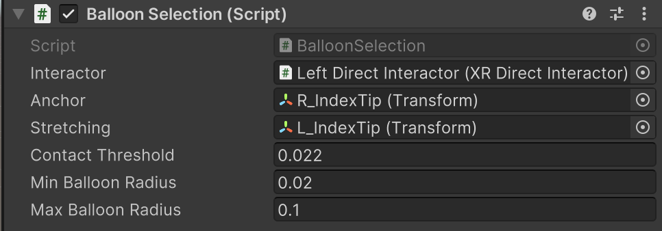
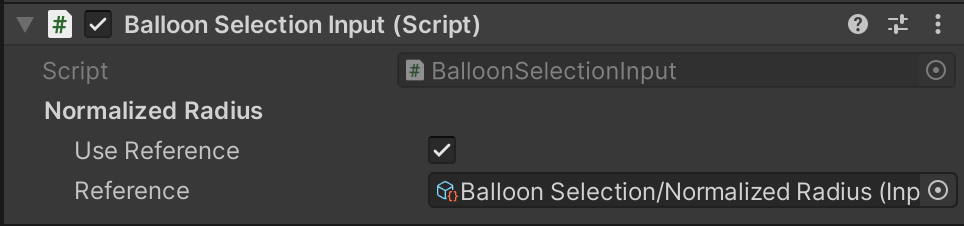
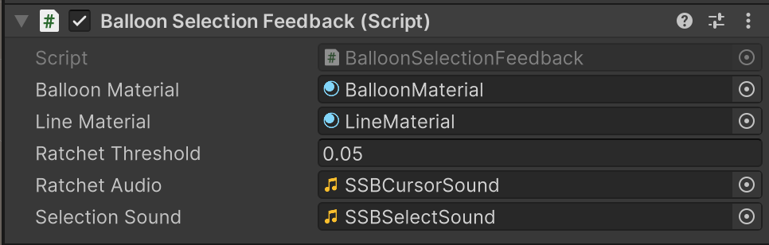
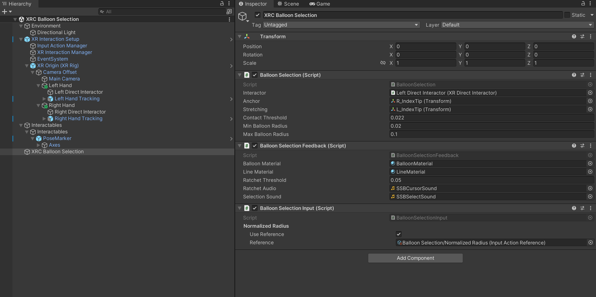

# XRC Balloon Selection

The package video can be viewed [here](https://drive.google.com/file/d/1pqIvgTJ7ZTy97WrvrbHzDz4pwyz_eg5S/view?usp=drive_link)

## Overview
This package is an implementation of the Balloon Selection interaction technique, using the XR Interaction Toolkit. The package includes three components and a sample, as described below.

## Components
### Balloon Selection
This component implements the logic for the Balloon Selection interaction technique as presented in the original paper, with modifications as outlined below.

The package differs from the original paper in several ways, primarily due to the fact that the original technique was implemented using a touch surface, while this package uses hand tracking:

- **Clutching**: The package does not implement clutching
- **One-handed operation**: The package does not implement one-handed operation
- **Assignment of “anchor” and “stretching”**: The paper sets the first surface touch as the anchor, and the second one as the stretching; this gives the user flexibility of choosing the role of each hand. The package assigns the “anchor” and “stretching” roles to objects before runtime.
- **Reset**: The package implements a reset feature that allows the user to reset by flipping their hand over

### Original paper:

Benko, H., and S. Feiner. 2007. “Balloon Selection: A Multi-Finger Technique for Accurate Low-Fatigue 3D Selection.” In 2007 IEEE Symposium on 3D User Interfaces. [https://doi.org/10.1109/3DUI.2007.340778](https://doi.org/10.1109/3DUI.2007.340778).

| **Property**         | **Description**          |
|----------------------|--------------------------|
| **Interactor** | 	The interactor responsible for selecting the object of interest. |
| **Anchor** | The transform of the anchor game object. This corresponds to the "anchor finger" mentioned in the original paper. |
| **Stretching** | The transform of the stretching game object. This corresponds to the "stretching finger" mentioned in the original paper. |
| **Contact Threshold** | Threshold for initiating the balloon selection technique. When the distance between anchor and stretching is below this threshold, the technique can be initiated. This allows the user to bring together the two game objects (for example fingers) to initiate the technique. |
| **Min Balloon Radius** | The minimum balloon radius |
| **Max Balloon Radius** | The maximum balloon radius|

### Balloon Selection Input
This component handles user input and updates the BalloonSelection component accordingly.

| **Property**         | **Description**          |
|----------------------|--------------------------|
| **Normalized Radius** | Input action property for gathering user input to change the balloon radius. The input action provides a value between 0-1. |

### Balloon Selection Feedback
This component provides visual and auditory feedback for the BalloonSelection technique.

| **Property**         | **Description**          |
|----------------------|--------------------------|
| **Balloon Material** | Material applied to the balloon and spheres representing the anchor and stretching game objects. |
| **Line Material** | Material for the line renderer used to draw the balloon string. |
| **Ratchet Threshold** | Threshold that defines the change in distance between anchor and stretching needed to trigger playback of the ratchetAudio clip. |
| **Ratchet Audio** | Audio clip to be played for ratchet auditory feedback, as demonstrated in the original paper. |
| **Selection Sound** | Audio clip to be played for selection auditory feedback. |

## Installation instructions
To install this package, follow these steps:
1. In the Unity Editor, click on **Window > Package Manager**
2. Click the + button and choose **Add package from git URL** option
3. Paste the URL to the package repository: [git@github.com:cs5678-2024sp/h-balloon-selection-Ruiznogueras05CT.git](git@github.com:cs5678-2024sp/h-balloon-selection-Ruiznogueras05CT.git) in the prompt and click on **Add** (make sure your URL ends with ".git")
4. If the repository is private, you will be asked to authenticate via your GitHub account. If you haven't been granted access to the repository you will not be able to install the package.
5. The package should be installed into your project
6. You can download the package samples from under the Samples tab in the Package Manager

Note: Even though the package documentation is public, several XRC packages are private and accessible only to XRC staff and students.

## Requirements
This package was developed and tested using the following Unity Editor version:

**2022.3.7f1 LTS**

Dependencies: 

- **XRC Core**
- **XR Interaction Toolkit**
- **Input System**

<!--
## Limitations	
If your package has any known limitations, you can list them here. If not, or if the limitations are trivial, exclude this section.

-->

## Workflow

See the below a screenshot for a scene hierarchy and the inspector for a game object containing all three package components.

## Samples
### XRC Balloon Selection Sample
This includes a sample showcasing the XRC Balloon Selection implementation in a Unity scene with hand tracking and passthrough enabled. The sample has the following dependencies:

- **XR Hands 1.4.0**
- **Unity OpenXR Meta 1.0.1**
- **OpenR Plugin 1.8.2**
- **AR Foundation 5.1.2**

