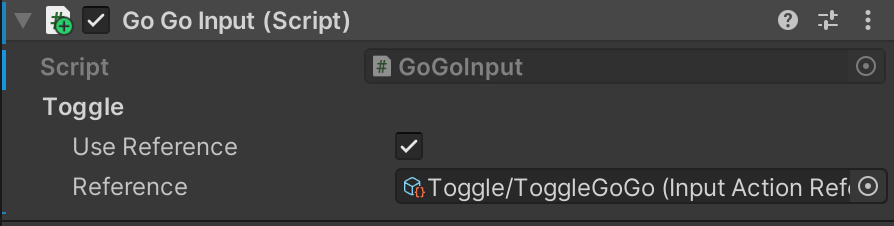

# XRC Go-Go
**Note: The final result of this package has a limitation where the Collision occurs at a certain distance away from Cube Interactor**

**Package video:**
 https://drive.google.com/file/d/1ytdBORSOr53gtxqqKP-TmU43-ZDYHzD2/view?usp=drive_link 

## Overview

This package is an implementation of the Go-Go interaction technique, using the XR Interaction Toolkit. The package includes three components and a sample, as described below.

## Components

### Go-Go
This component implements the logic for the Go-Go interaction technique as presented in the original paper. This component holds a reference to an interactor (XR Interaction Toolkit), which will be modified to produce a behaviour identical to the originally proposed technique. The Go-Go mapping function calculates the "virtual hand" position that is applied to the interactor's attach transform and collider.

**Original paper:**
Ivan Poupyrev, Mark Billinghurst, Suzanne Weghorst, and Tadao Ichikawa. 1996. The go-go interaction technique: non-linear mapping for direct manipulation in VR. In Proceedings of the 9th annual ACM symposium on User interface software and technology (UIST '96). Association for Computing Machinery, New York, NY, USA, 79–80. https://doi.org/10.1145/237091.237102. 

| **Property**         | **Description**          |
|----------------------|--------------------------|
| **Interactor** | The interactor responsible for selecting the object of interest. |
| **Head To Chest** | User-provided value that represents the distance from head (between eyes) to chest, used to calculate the origin, as presented in the original paper. |
| **K** | Coeffiecient for the mapping function. This corresponds to k in the original paper. |
| **Threshold | Threshold for the mapping function. This corresponds to D in the original paper. |

### Go-Go Input
This component handles user input and updates the GoGo component accordingly.

| **Property**         | **Description**          |
|----------------------|--------------------------|
| **Toggle** | 	Input action to toggle run state of the Go-Go component. This will call ToggleRun() on Go-Go. |

### Go-Go Feedback
This component is responsible for providing feedback for the Go-Go interaction technique. This includes rendering a circle for visualizing the threshold parameter of the technique. This component also visualizes the virtual hand, providing feedback on its position and orientation.

#### Note: the reference "Virtual Hand" is instantiated by the script itself

| **Property**         | **Description**          |
|----------------------|--------------------------|
| **Color** | 	The color applied to the circle used for threshold feedback. This color is also applied to the material of the game object instantiated from the virtualHandPrefab. |
| **Virtual Hand Prefab** | Prefab used for visualizing the virtual hand, such as a 3D model of a VR controller. The game object instantiated from this prefab provides feedback for virtualHandPosition, a property from GoGo. The alpha value of the game object's material color is controlled by the distance to the real hand position, resulting in a fade-in / fade-out behaviour of the virtual hand feedback object. |

## Installation instructions
To install this package, follow these steps:
1. In the Unity Editor, click on **Window > Package Manager**
2. Click the + button and choose **Add package from git URL** option
3. Paste the URL to the package repository: git@github.com:cs5678-2024sp/h-go-go-Ruiznogueras05CT.git in the prompt and click on **Add** (make sure your URL ends with ".git")
4. If the repository is private, you will be asked to authenticate via your GitHub account. If you haven't been granted access to the repository you will not be able to install the package.
5. The package should be installed into your project
6. You can download the package samples from under the Samples tab in the Package Manager

Note: Even though the package documentation is public, several XRC packages are private and accessible only to XRC staff and students.

## Requirements
This package was developed and tested using the following Unity 

Editor version:
  - 2022.3.7f1 LTS

Dependencies:
  - XRC Core
  - XR Interaction Toolkit
  - Input System

## Limitations	
In this implementation: 

**The XRC GoGo GameObject is disabled and all the important scripts are referenced in the Direct Interactor due to multiple bugs**

**The Collision interaction occurs when the virtual hand is halfway through the distance between the real hand and the interactor cube**

## Workflow

See below the screenshot for a scene hierarchy and the inspector for a game object containing all three package components.

## Samples
### XRC Go-Go Sample
The includes a sample showcasing the XRC Go-Go implementation in a Unity scene.
**Notice: New XRC Go-Go and Old v1XRC Go-Go are old sample scenes that fell under logic error that couldn't be resolved, please ignore**

