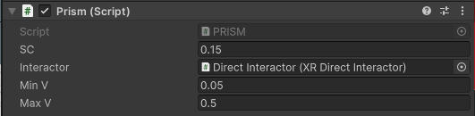
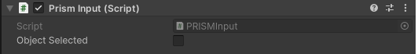
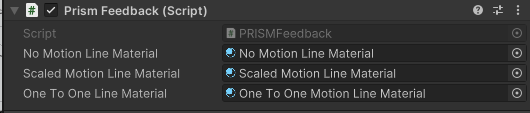
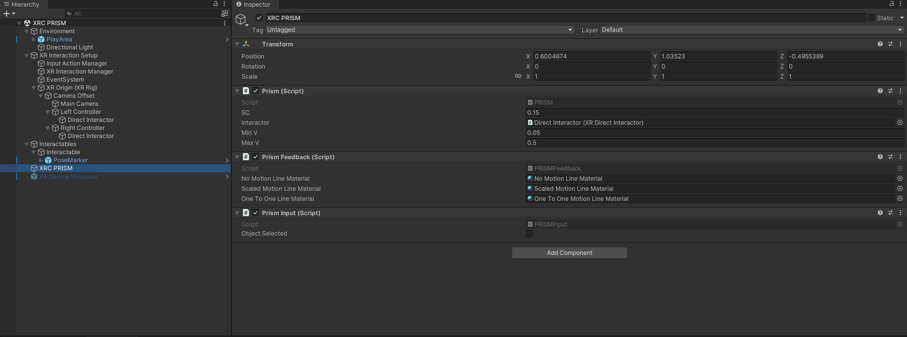
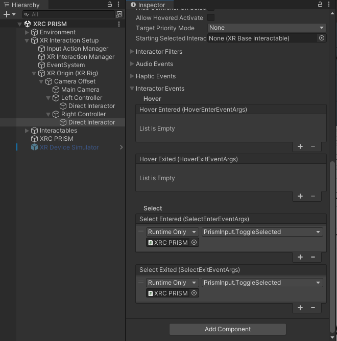

# XRC PRISM

## Overview
This package is an implementation of the PRISM interaction technique, using the XR Interaction Toolkit. The package includes three components and a sample, as described below.

## Components

### PRISM
This component implements the logic for the Prism interaction technique as presented in the original paper, with modifications as outlined below.

The package differs from the original paper in some ways:

- We simplified the offset recovery implementation by only implementing the offset recovery as instantaneous, and not over time
- We changed the value of Max V to be 0.5 instead of the 0.25 described in the original paper

### Original Paper:

Frees, Scott, and G. Drew Kessler. "Precise and rapid interaction through scaled manipulation in immersive virtual environments." IEEE Proceedings. VR 2005. Virtual Reality, 2005.. IEEE, 2005.
https://ieeexplore.ieee.org/abstract/document/1492759

| **Property**         | **Description**          |
|----------------------|--------------------------|
| **SC** | The float representing the scaling constant of the PRISM technique. |
| **Interactor** | The interactor responsible for selecting the object of interest. |
| **Min V** | The float representing the minimum velocity to move the interactable. | 
| **Max V** | The float representing the maximum velocity to recover the interactable to the current hand position.|

### PRISM Input
This component handles user input and updates the toggling feature of the object selection.

| **Property**         | **Description**          |
|----------------------|--------------------------|
| **Object Selected** | Bool variable that represents if the object has been selected. |

### PRISM Feedback
This component is responsible for providing feedback for the Prism interaction technique. This includes rendering the line renderer between the hand and the currently selected interactable.

| **Property**         | **Description**          |
|----------------------|--------------------------|
| **NoMotionlineMaterial** | Red material for the line renderer used to draw the string representing the stopped motion. |
| **ScaledMotionlineMaterial** | Yellow material for the line renderer used to draw the string representing the scaled motion. |
| **OneToOnelineMaterial** | Green material for the line renderer used to draw the string representing the one to one motion. |

## Installation instructions
To install this package, follow these steps:
1. In the Unity Editor, click on **Window > Package Manager**
2. Click the + button and choose **Add package from git URL** option
3. Paste the URL to the package repository: git@github.com:cs5678-2024sp/h-prism-g-02.git or https://github.com/cs5678-2024sp/h-prism-g-02.git in the prompt and click on **Add** (make sure your URL ends with ".git")
4. If the repository is private, you will be asked to authenticate via your GitHub account. If you haven't been granted access to the repository you will not be able to install the package.
5. The package should be installed into your project
6. You can download the package samples from under the Samples tab in the Package Manager

Note: Even though the package documentation is public, several XRC packages are private and accessible only to XRC staff and students.

## Requirements
This package was developed and tested using the following Unity Editor version:

**2022.3.7f1 LTS**

Dependencies:
- **Mathematics**
- **XR Interaction Toolkit**

<!--
## Limitations	
If your package has any known limitations, you can list them here. If not, or if the limitations are trivial, exclude this section.

-->

## Workflow

See below a screenshot for a scene hierarchy and the inspector for a game object containing all three package components.

See below a screenshot for setting up the input selection feature

## Samples

### XRC PRISM
This includes a sample showcasing the XRC PRISM implementation in a Unity scene.

